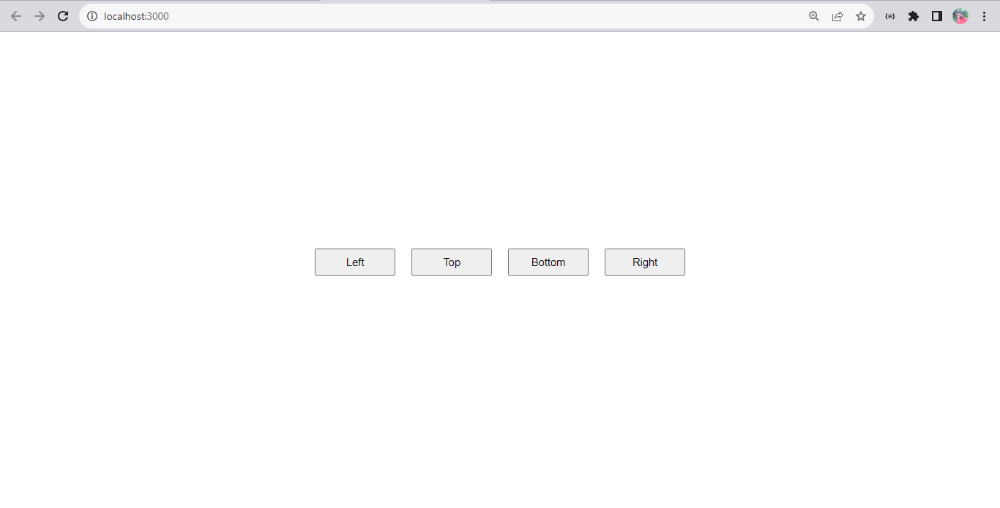
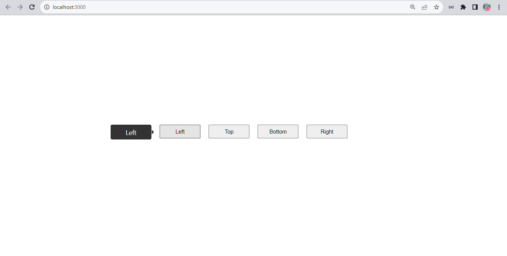
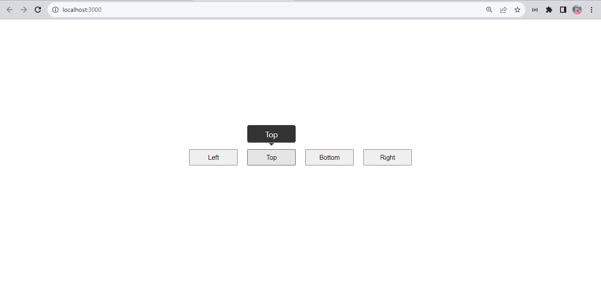
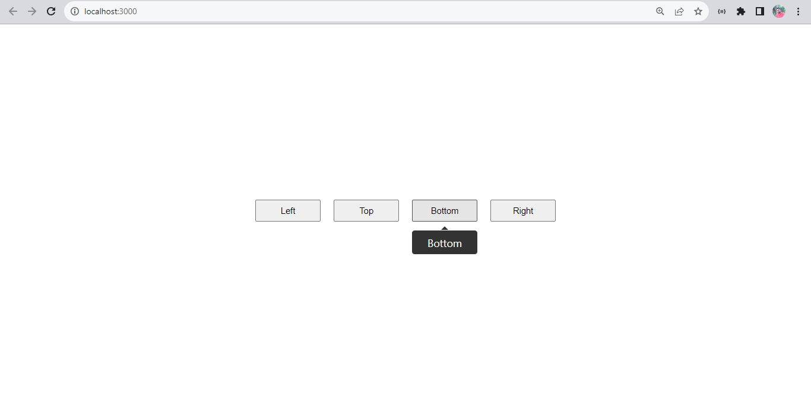
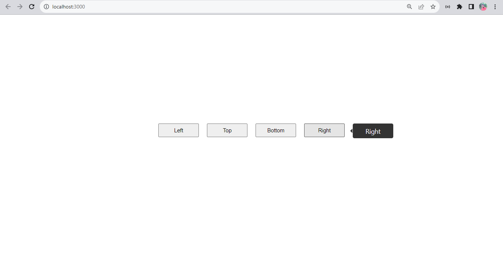

# Tooltip React App

This is a Tooltip Project, Which has four distint button or we say content and when we hover mouse over any of that particular button this will show a Tooltip box with specific tip written on it.

## Hosted Link:
[https://google.com](google.com)

### Screenshot: Home-page

### Screenshot: Showing Left Tooltip

### Screenshot: Showing Top Tooltip

### Screenshot: Showing Bottom Tooltip

### Screenshot: Showing Right Tooltip
